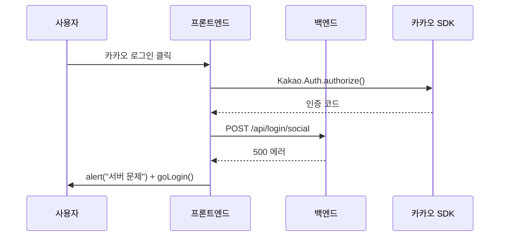

# Jira 티켓/댓글 작성 스킬

Jira 이슈 생성 또는 댓글 작성 요청 시 아래 절차를 따른다.

## 기본 설정

| 항목 | 값 |
|------|-----|
| cloudId | `timplus.atlassian.net` |
| projectKey | `GRW` (사용자가 다른 프로젝트를 지정하면 변경) |
| contentFormat | `markdown` |
| 협업자 | 김용문 |

## STEP 1: 사전 분석

티켓 내용에 코드 분석이 필요하면 **먼저 코드를 읽고 분석**한 뒤 티켓을 작성한다.
이미 분석이 끝난 상태라면 바로 STEP 2로 진행한다.

## STEP 2: 이슈 타입 판단

내용을 보고 적절한 이슈 타입을 선택한다:

| 상황 | 이슈 타입 |
|------|----------|
| 기존 기능이 의도와 다르게 동작 | 버그 |
| 새 기능 추가, 리팩토링, 설정 변경 | 작업 |
| 사용자 관점 기능 요구사항 | 스토리 |

## STEP 3: 제목 작성

형식: `[prefix] 핵심 내용 요약`

- prefix: `[FE]`, `[BE]`, `[INFRA]`, `[DESIGN]` 등 영역 표시
- 70자 이내
- 한글 사용, 명사형 종결

좋은 예: `[FE] 로그인 완료 후 메인에서 뒤로가기 시 로그인 화면으로 돌아가는 문제`
나쁜 예: `로그인 버그` (prefix 없음, 내용 불명확)

## STEP 4: 본문 작성

이슈 타입에 따라 아래 구조를 사용한다. 단락 순서를 지킨다.

### 버그 티켓 구조

```
## 현상
- 사용자 관점 증상 (환경 포함: 웹/앱/모바일)
- "~하면 ~가 된다" 형식으로 명확하게

## 원인 분석
- 코드 레벨 원인 (`파일:라인` 참조 포함)
- flow나 상태 변화가 있으면 코드블록 다이어그램으로 시각화

## 수정 방향
- 최소 2가지 방안 제시
- 각 방안의 변경 범위와 장단점을 **표로 비교**
- **권장 방안을 명시**하고 이유를 한 줄로 설명

## 영향 범위
- 수정 대상 함수/컴포넌트를 사용하는 화면 목록

## 재현 방법
1. 단계별 재현 절차
2. 마지막에 "기대: ~ / 실제: ~" 형식으로 기대-실제 대비

## 수용 기준 (AC)
- [ ] 체크리스트 형태로 완료 조건 명시
- [ ] 최소 3개 이상

---
🤖 이 내용은 김용문 + Claude Code가 협업하여 작성했습니다.
```

### 작업/스토리 티켓 구조

```
## 배경
- 이 작업이 필요한 이유 (비개발자도 이해 가능하게)

## 변경 내용
- 구체적 변경 사항
- 규모가 크면 Phase로 분리

## 영향 범위
- 관련 파일/화면 목록

## 수용 기준 (AC)
- [ ] 완료 조건 체크리스트
- [ ] 최소 3개 이상

---
🤖 이 내용은 김용문 + Claude Code가 협업하여 작성했습니다.
```

### 각 단락 작성 가이드

**현상/배경**: PM이나 비개발자가 읽어도 무슨 문제인지 알 수 있어야 한다. 기술 용어 앞에 사용자 행동을 먼저 쓴다.

**원인 분석**: 코드 위치를 `src/파일:라인` 형식으로 포함한다. 상태 변화나 데이터 흐름이 복잡하면 다이어그램을 추가한다 (아래 "다이어그램 가이드" 참조).

**수정 방향**: 방안이 하나뿐이더라도 "변경 없음(현상 유지)"을 대안으로 넣어서 왜 변경이 필요한지 드러낸다. 표 형식 예시:

```markdown
| 방안 | 변경 범위 | 장점 | 단점 |
|------|----------|------|------|
| 방안 1: ... | 파일 1개 | 최소 변경 | 부분 해결 |
| **방안 2 (권장)**: ... | 파일 3개 | 완전 해결 | 회귀 테스트 필요 |
```

**수용 기준(AC)**: 이 티켓이 "완료"되려면 무엇이 확인되어야 하는지를 체크리스트로 작성한다. 코드 변경뿐 아니라 검증 항목도 포함한다.

## 다이어그램 가이드

흐름이 복잡한 버그나 기능은 다이어그램으로 시각화하면 이해가 빨라진다. Jira Cloud는 Mermaid를 기본 렌더링하지 않으므로 아래 두 가지 방식 중 택한다.

### 방식 1: ASCII 플로우 (간단한 흐름)

상태 변화나 history stack처럼 단순한 흐름에 적합하다.

```
사용자 클릭 → SNS SDK → /api/login/social → status 분기
                                              ├─ 200: 로그인 완료
                                              ├─ 500: alert → goLogin()
                                              └─ else: (현재 무처리)
```

### 방식 2: Mermaid 시퀀스 다이어그램 (복잡한 흐름)

여러 시스템 간 상호작용이 있을 때 사용한다. Jira에서는 코드블록으로 보이지만, 구조를 읽는 데는 충분하다.

````

````

시퀀스 다이어그램은 아래 경우에 넣는다:
- 프론트/백엔드/외부 API 간 요청-응답이 3단계 이상
- 에러 발생 지점을 명확히 보여줘야 할 때
- 타이밍이 중요한 비동기 흐름

단순한 상태 분기나 history stack은 ASCII 플로우로 충분하다.

## STEP 5: 자체 검증

티켓을 생성하기 전에 아래를 확인한다:

1. 현상/배경이 비개발자도 이해 가능한가?
2. 코드 위치 참조(`파일:라인`)가 포함되어 있는가?
3. 수정 방향이 복수 방안 + 비교 표로 되어 있는가?
4. 권장 방안과 이유가 본문에 명시되어 있는가?
5. AC(수용 기준)가 체크리스트로 있는가?
6. 하단 협업 표기가 있는가?

누락된 항목이 있으면 보완한 뒤 생성한다.

## STEP 6: Jira API 호출

### 티켓 생성

```
mcp__claude_ai_Atlassian__createJiraIssue
  cloudId: "timplus.atlassian.net"
  projectKey: "GRW"
  issueTypeName: "버그" | "작업" | "스토리"
  summary: "[prefix] 제목"
  description: "본문 (markdown)"
  contentFormat: "markdown"
```

### 댓글 추가

```
mcp__claude_ai_Atlassian__addCommentToJiraIssue
  cloudId: "timplus.atlassian.net"
  issueIdOrKey: "GRW-XXX"
  commentBody: "댓글 내용"
  contentFormat: "markdown"
```

생성/작성 완료 후 사용자에게 티켓 URL을 보여준다.

## 댓글 작성 규칙

Jira 댓글을 작성할 때:

1. **결론 먼저**: 권장안이나 핵심 판단을 첫 문장에 쓴다
2. **근거는 뒤에**: 코드 참조, 비교 표, 다이어그램 순서로 뒷받침
3. **비교 시각화**: before/after가 있으면 코드블록이나 다이어그램으로 대비
4. **협업 표기**: 댓글 하단에 `🤖 이 내용은 김용문 + Claude Code가 협업하여 작성했습니다.` 포함
